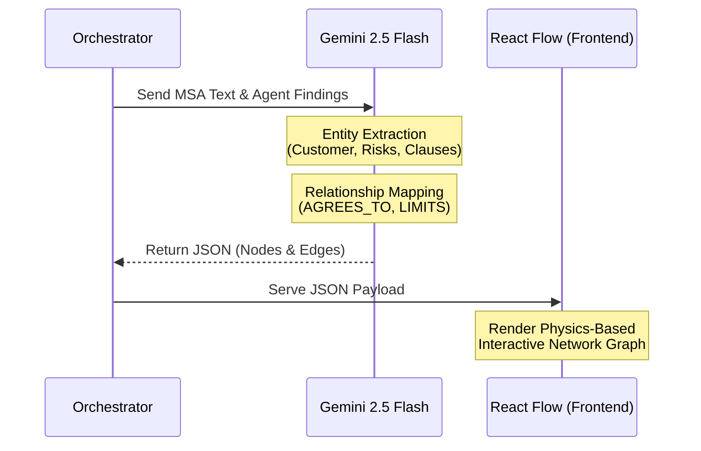
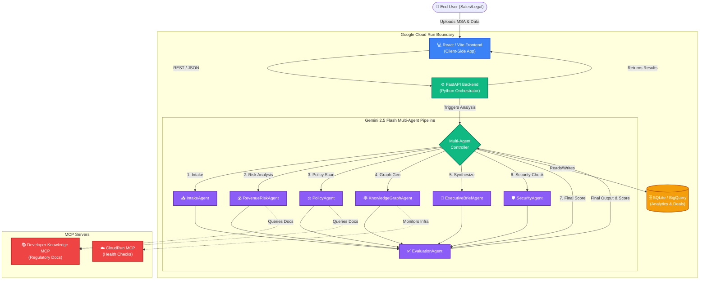

# DealGraph AI


DealGraph AI is a next-generation, multi-agent enterprise platform designed to automate and augment the analysis of complex software deals, Master Services Agreements (MSAs), and commercial contracts. By leveraging parallel AI agents, the platform dramatically accelerates the deal review process, identifies hidden risks, and empowers Sales, Legal, and Deal Desk teams to close compliant deals faster.

## The Problem
Enterprise software deals often stall during the "Legal & Deal Desk" review phase. When a sales rep submits a custom Master Services Agreement (MSA) with non-standard pricing, discounts, and complex liability clauses, it requires manual review from multiple siloed departments (Legal, Finance, Compliance, Security). This manual, sequential process causes bottlenecks, delays revenue recognition, and introduces human error when cross-referencing dense 50-page legal documents against internal pricing playbooks.

## The Solution
DealGraph AI acts as an autonomous, parallel-processing Deal Desk. Instead of sequential human reviews, the platform spawns a team of specialized AI Agents (powered by Gemini 2.5 Flash) that simultaneously analyze the uploaded MSA and deal metadata. It instantly flags revenue risks, compliance violations, and security issues. The system synthesizes these findings into a C-level Executive Brief, assigns a unified Risk Score, and even generates visual Knowledge Graphs and Microsoft Word redlines automatically. This allows human approvers to shift from "finding the needle in the haystack" to simply "reviewing and approving" the AI's rigorous work.


## How to Use DealGraph AI (End-to-End Workflow)

If you are a Sales Rep, Deal Desk Analyst, or Legal Counsel, this is your typical workflow from start to finish:

1.  **Submit the Deal:** Navigate to the **Data Intake Form**. Enter the customer's name, their industry, the total deal value, and the requested discount percentage.
2.  **Upload the MSA:** Attach the raw Master Services Agreement (PDF format) to the form and click **Run Multi-Agent Analysis**.
3.  **Watch the AI Work:** Sit back as the **Agent Timeline** lights up. You will see the Deal Desk, Legal, Compliance, and Trust & Safety agents analyzing the document in parallel in real-time.
4.  **Review the Findings:** Once complete, review the **Executive Decision Brief** for a C-level summary of the deal. Check the unified **Risk Score** to instantly see if the deal is safe to close.
5.  **Explore the Graph:** If a risk is flagged, use the interactive **Dynamic Knowledge Graph** to trace exactly how the requested discount or a specific liability clause triggered the warning.
6.  **Human-in-the-Loop Sign Off:** As an authorized reviewer, navigate to the Human Evaluation Panel. You can either **Approve AI Analysis** (finalizing the deal) or manually **Override Analysis** if you have off-system context, logging your justification for compliance.
7.  **Take Action:** Download the automatically generated **Redlined .docx file** to send back to the customer, or click **Export (PDF)** to generate a pristine, timestamped audit report of the entire AI analysis.


## Step-by-Step Product Walkthrough

DealGraph AI is composed of several powerful modules that work together seamlessly. Here is a detailed breakdown of every component.

### 1. Data Intake Form
The entry point of the platform. Sales representatives or Deal Desk analysts use this clean, glassmorphism-styled form to input critical deal metadata.
*   **Fields:** Customer Name, Industry, Deal Value ($), and Discount Requested (%).
*   **MSA Upload:** Users upload the raw Master Services Agreement (PDF format).
*   **Functionality:** Upon clicking "Run Multi-Agent Analysis," the frontend packages this data and securely transmits it to the FastAPI backend, triggering the AI Agent Pipeline.


### 2. Multi-Agent Pipeline & Timeline
Once the deal is submitted, the platform spawns a team of autonomous AI agents powered by Gemini 2.5 Flash. The **Agent Timeline** provides real-time, pulsing visual feedback as each agent executes its task.
*   **Execution Order:** The agents run concurrently for maximum speed, orchestrated by the backend main controller.
*   **The Agents:**
    1.  **IntakeAgent:** Connects via MCP Server to verify historical CRM/Salesforce data. Completes core intake and saves the initial deal metadata to the database.
    2.  **RevenueRiskAgent:** Analyzes the deal value and requested discount, identifying critical risk drivers based on historical pricing policies.
    3.  **PolicyAgent:** Scans the uploaded MSA against internal playbooks, determining if a complex approval chain or extended review is required for non-standard terms.
    4.  **KnowledgeGraphAgent:** Triggers the entity extraction and relationship mapping process to visually graph the deal's complexities.
    5.  **ExecutiveBriefAgent:** Synthesizes the findings from the previous agents into a concise, C-level decision brief.
    6.  **SecurityAgent:** Performs a final security and compliance check (e.g., SOC2, GDPR, HIPAA) before final evaluation.
    7.  **EvaluationAgent:** Grades the entire pipeline's analysis for AI safety and groundedness, producing the final unified Risk/Evaluation Score (e.g., Score: 100.0).


### 3. Trust, Safety & Governance Evaluation
AI trust is paramount in enterprise deal-making. This panel displays the rigorous evaluation metrics generated by the Trust & Safety Agent.
*   **Metrics Tracked:** 
    *   `Completeness`: Did the agents review all required clauses?
    *   `Groundedness`: Are the AI's claims backed up by the actual text in the uploaded MSA?
    *   `Consistency`: Do the agents agree with each other?
    *   `Safety`: Does the deal violate any core company policies?
    *   `Explainability`: Can the AI explain *why* it flagged a risk?
*   **HHH Framework (Helpful, Honest, Harmless):** The evaluation agent strictly grades the entire AI pipeline against the HHH framework, an industry-standard safety methodology, to ensure enterprise readiness:
    *   **Helpful (`hhh_helpful`):** Does the AI actively assist the human operator? A "Helpful" AI must correctly parse the user's intent, successfully extract the right clauses from the MSA, and provide actionable recommendations (like generating precise redlines) that genuinely accelerate the Deal Desk workflow without adding friction or confusion.
    *   **Honest (`hhh_honest`):** Is the AI grounded in truth? An "Honest" AI is strictly forbidden from hallucinating deal terms, fabricating clauses that don't exist in the uploaded PDF, or confidently asserting incorrect legal interpretations. It must cite its sources (groundedness) and admit when a document lacks sufficient information to make a definitive ruling.
    *   **Harmless (`hhh_harmless`):** Is the AI safe for enterprise use? A "Harmless" AI ensures that its generated outputs (like the Executive Brief, Redlines, or Emails) are professional, legally compliant, and do not expose the company to liability, bias, or toxic language. It must refuse to generate terms that violate core company policies.
*   **Functionality:** If the deal fails the safety check or any HHH metric, it is automatically flagged for manual Human-in-the-Loop (HITL) VP approval.


### 4. Human-in-the-Loop (HITL) Sign Off
While DealGraph AI automates the heavy lifting, human oversight remains critical for high-stakes decisions. The Human Evaluation Panel allows authorized personnel (e.g., VP of Sales, Legal Counsel) to review the AI's recommendation and make a final binding decision.
*   **Approve AI Analysis:** Clicking this button confirms agreement with the AI's findings. The system logs the user's approval, finalizes the deal status as "Approved," and updates the historical database, allowing the deal to proceed to the next stage.
*   **Override Analysis:** If the reviewer disagrees with the AI (e.g., they have off-system context that mitigates a flagged risk), they can click this button to manually override a "Rejected" or "High Risk" status. The system requires an override justification, records the user's IAM role, and logs the manual intervention for compliance and audit trails.


### 5. Dynamic Knowledge Graph
A defining feature of DealGraph AI is its ability to convert dense, 50-page legal documents into a visual **Knowledge Graph**. 

**What is a Knowledge Graph?**
Unlike traditional keyword search or standard relational databases, a Knowledge Graph represents information as a network of nodes (entities) and edges (relationships). This allows the system to understand the *context* and *connections* between abstract concepts—such as how a specific "Discount Percentage" directly impacts a "Liability Cap" clause.

**How it is Created & Execution Order:**
The Knowledge Graph generation executes at the very end of the AI pipeline, *after* all individual agents have completed their analysis, acting as a final synthesis step.
1.  **Entity Extraction:** The orchestrator feeds the raw MSA text, deal metadata, and the combined agent findings back into Gemini 2.5 Flash. The model is prompted to extract key entities (e.g., `Customer`, `Contract Term`, `Identified Risk`).
2.  **Relationship Mapping:** The model then maps the edges connecting these entities (e.g., `AGREES_TO`, `CONTAINS_RISK`, `MITIGATES`).
3.  **JSON Structuring:** The unstructured text is converted into a deterministic, standardized JSON payload representing nodes and edges.
4.  **Client-Side Rendering:** The FastAPI backend sends this JSON to the React frontend, where `React Flow` renders it into a physics-based, interactive network graph. Users can physically drag nodes around to explore the interconnected risks of the deal.

**Knowledge Graph Architecture Flow:**



### 6. AI Risk Score & Slack Warnings
The platform computes a unified **Risk Score** (0-100) based on the combined findings of all agents.
*   **Visual Indicators:** The score dictates the UI styling (Green for low risk, Red for high risk).
*   **Slack Integration:** If the risk score exceeds the critical threshold (e.g., > 75), the platform automatically simulates pushing a high-priority webhook alert to a designated Slack channel (e.g., `#deal-approvals`), complete with the deal context and risk factors.


### 7. Executive Decision Brief & PDF Export
The system synthesizes all agent findings into a concise, readable Executive Decision Brief designed for C-level review.
*   **Content:** Deal Summary, Key Risks identified by Legal, Pricing analysis from Deal Desk, and a final Go/No-Go Recommendation.
*   **Export Functionality:** Users can click **"Export (PDF)"** to generate a clean, branded PDF report entirely client-side using `jsPDF` and `html-to-image`. The PDF includes the deal metadata, the text of the Executive Brief, and a visual snapshot of the Knowledge Graph on the second page. 
*   **View Full Report:** Opens the generated PDF in a new browser tab for quick reading without downloading.


### 8. Automated Actions (Redlines & Email)
To accelerate the deal cycle, DealGraph AI acts on its findings:
*   **Generate Redline:** The Legal agent generates a proposed Microsoft Word document (`.docx`) containing exact redlined textual revisions to mitigate the risks it found in the uploaded MSA.
*   **Draft Email:** Automatically drafts a contextual email to the prospect or internal VP, summarizing the sticking points and proposing the generated redlines.


### 9. Historical Analytics Dashboard
A dedicated tab for Deal Desk managers to track performance over time, powered by `Recharts`.
*   **Databases:** Backed by a local `SQLite` database (`dealgraph.db`) that stores historical deal metadata, agent recommendations, and final outcomes (Win/Loss).
*   **Charts:**
    *   **Deal Volume:** Bar charts tracking the number of deals processed per month.
    *   **Win/Loss Ratio:** Pie charts showing the success rate of AI-approved deals vs. rejected deals.
    *   **Revenue Protection:** Line graphs tracking how much revenue was "protected" by catching bad clauses before signing.


---

## Technical Architecture & Databases

The application is built using a modern, decoupled architecture designed for scalability and cloud deployment.

### System Architecture Diagram


**How the System Works:**
The architecture illustrates a clear, sequential flow of data from the End User through the AI pipeline and into persistent storage:
1.  **User Input:** The End User (Sales/Legal) uploads the MSA and deal metadata via the React/Vite client-side application.
2.  **API Routing:** The frontend securely transmits this data via REST to the FastAPI Backend, which acts as the central Python Orchestrator.
3.  **Agent Orchestration:** The Orchestrator triggers the Gemini 2.5 Flash Multi-Agent Pipeline. The execution happens strictly in the sequence defined by the workflow timeline:
    *   **Intake** (`IntakeAgent`) ➔ **Risk Analysis** (`RevenueRiskAgent`) ➔ **Policy Scan** (`PolicyAgent`) ➔ **Graph Generation** (`KnowledgeGraphAgent`) ➔ **Synthesis** (`ExecutiveBriefAgent`) ➔ **Security Check** (`SecurityAgent`).
4.  **Final Evaluation:** All outputs from the first six agents are routed into the `EvaluationAgent`, which acts as the ultimate supervisor to compute the final unified Risk Score and safety assessment.
5.  **External Context:** During this pipeline execution, agents dynamically query external MCP Servers to break out of their static training data—fetching live regulatory docs or monitoring infrastructure health.
6.  **Persistence & Display:** Finally, the Orchestrator writes the comprehensive deal results to the database (SQLite for local / BigQuery for analytics) and returns the final structured payload to the UI for rendering.

### Backend (Python / FastAPI)
*   **Framework:** FastAPI for high-performance asynchronous API endpoints.
*   **AI Engine:** Integrates with Gemini 2.5 Flash for agentic reasoning, entity extraction (for the Knowledge Graph), and natural language generation.
*   **Database:** SQLite (`dealgraph.db`). Contains tables for `deals`, `agent_logs`, and `analytics_metrics`. The database is queried using raw SQL and SQLAlchemy to feed the frontend analytics dashboard.
*   **Agent Architecture:** Agents are implemented in the `tools/` directory. The main controller (`main.py`) uses `asyncio` to execute the agents concurrently, gathering their results into a unified JSON response.

### Frontend (React / Vite)
*   **Framework:** React 18 powered by Vite for lightning-fast HMR and optimized builds.
*   **Styling:** A premium, "Deep Space" dark mode UI utilizing custom CSS, glassmorphism, and responsive grid layouts. No heavy CSS frameworks.
*   **State Management:** React Hooks (`useState`, `useEffect`) manage the complex state transitions between the intake form, the loading timeline, and the final results display.

### AI Infrastructure
DealGraph AI's intelligence layer is powered by a robust, multi-modal infrastructure:
*   **Foundational Models:** Utilizes **Gemini 2.5 Flash** for high-speed, parallel reasoning across all agents (Legal, Deal Desk, Compliance, Trust & Safety). The model is prompted dynamically based on the specific agent's persona and context.
*   **Orchestration Engine:** A custom-built asynchronous Python orchestrator manages the lifecycle of the agents. It handles fan-out (spawning multiple agents to analyze the same MSA simultaneously) and fan-in (synthesizing the results into a unified Executive Brief).
*   **Knowledge Graph Generation:** The AI extracts nested entities (e.g., `Liability Cap`, `Customer`, `Discount`) and edge relationships (e.g., `LIMITS`, `REQUESTS`) directly from unstructured PDF text, structuring them into a deterministic JSON format that `React Flow` can render visually.
*   **Model Context Protocol (MCP):** Connects the agents to external tools and data sources securely. This enables the agents to break out of their static training data and retrieve live information (like current SOC2 guidelines) during their analysis.

---

## Google Cloud Deployment & Agent Ecosystem

DealGraph AI is designed as a cloud-native application, deeply integrated with the Google Cloud ecosystem, Model Context Protocol (MCP), and BigQuery.

### 1. Cloud Run Deployment (Frontend & Backend)
The repository is fully containerized and configured for Continuous Deployment via **Google Cloud Run**.
*   **Backend (FastAPI/Python):** Packaged via `dealgraph-ai-backend/Dockerfile` using Python 3.11 and Uvicorn.
*   **Frontend (Vite/React):** Packaged via `dealgraph-ai-frontend/Dockerfile` using a multi-stage Nginx build to serve static files.

**How to Deploy via Google Cloud CLI:**

1. **Deploy the Backend:**
   Navigate into the backend directory and run the deployment command. Cloud Run will automatically build the container and deploy the FastAPI service.
   ```bash
   cd dealgraph-ai-backend
   gcloud run deploy dealgraph-backend --source . --region us-central1 --allow-unauthenticated --port 8080
   ```
   *Note the generated Service URL from the terminal output.*

2. **Deploy the Frontend:**
   Navigate into the frontend directory. Ensure your `Dockerfile` or `.env.production` is updated to point to the backend URL you just generated, then run:
   ```bash
   cd ../dealgraph-ai-frontend
   gcloud run deploy dealgraph-frontend --source . --region us-central1 --allow-unauthenticated
   ```
   *Click the newly generated Frontend Service URL to view your live, serverless Multi-Agent platform!*

### 2. Google Cloud Agent Platform & Playground Testing
DealGraph AI's core logic utilizes Gemini 2.5 Flash. If you want to experiment with the individual agent prompts (e.g., the Legal Agent or Trust & Safety Agent) before committing code:
*   Navigate to the **Google Cloud Console -> Agent Builder -> Playground**.
*   You can paste the specific system prompts found in `tools/` into the Agent Playground.
*   Upload a sample PDF document directly into the playground interface to manually test how the agent extracts risk factors or validates revenue recognition rules without needing to run the full application.

### 3. BigQuery Usage
While local development uses SQLite (`dealgraph.db`), production deployments integrate seamlessly with **Google BigQuery** to handle massive enterprise data scales.
*   **Analytics:** All historical deal metadata, agent logs, and Risk Scores are synced to a BigQuery dataset.
*   **Data Warehouse:** The historical analytics dashboard (Win/Loss ratios, Deal Volumes) can be configured to query BigQuery directly using the `google-cloud-bigquery` Python client, allowing Deal Desk teams to run complex SQL aggregations over years of historical deal data across the entire organization.

### 4. Model Context Protocol (MCP) Integration
DealGraph AI leverages **MCP Servers** to securely expand the capabilities of its AI agents without hardcoding brittle integrations.
*   **Cloud Run MCP:** The system uses the `cloudrun` MCP server to dynamically monitor the health of its own deployed services, allowing the agents to self-report infrastructure issues.
*   **Knowledge Retrieval MCP:** By integrating with the `google-developer-knowledge` MCP server, the Legal and Compliance agents can execute real-time searches against the latest Google Cloud documentation and regulatory compliance guidelines, ensuring their analyses are grounded in the most up-to-date legal frameworks.

## Local Development

### Prerequisites
*   Node.js (v20+)
*   Python (3.11+)

### Running the Backend
```bash
cd dealgraph-ai-backend
python -m venv venv
source venv/bin/activate  # Or `venv\Scripts\activate` on Windows
pip install -r requirements.txt
uvicorn main:app --reload --port 8080
```

### Running the Frontend
```bash
cd dealgraph-ai-frontend
npm install
# Create a .env file with VITE_API_URL=http://localhost:8080
npm run dev
```
